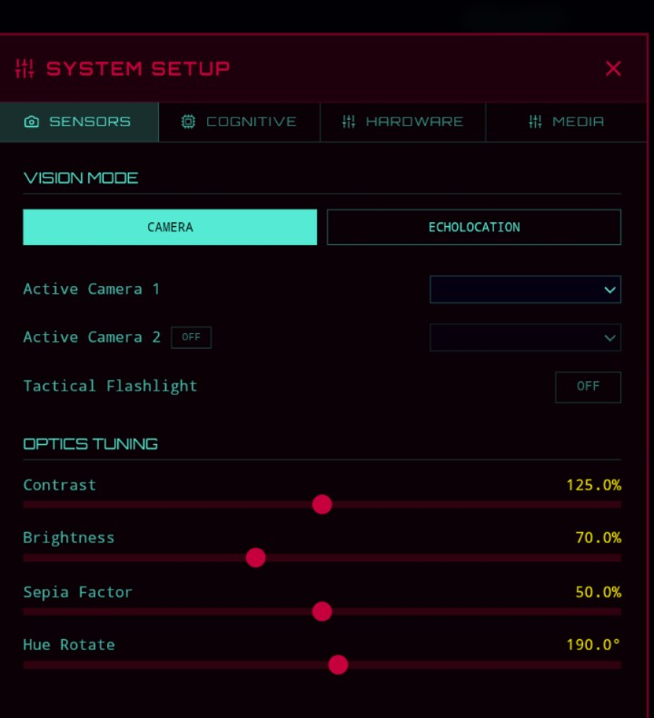
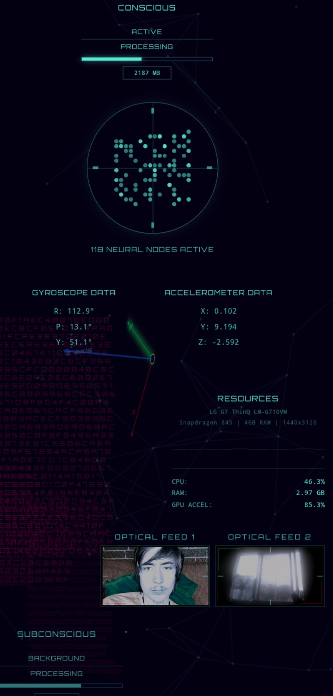

# AKOSHI-Relic-chip-program
AKOSHI: By Relic®️ Is a program written by Cosmic, aka Sketti, aka Flyingsgpaghettimonster. This program is meant for use in robots, specifically the program is designed to take all senses from [...]

Support me on: 🩵❤️ TikTok @sk3tt.i  
                ⚪🔴 Youtube @spongesgetti

## Screenshots

### App Interface

---

## Features

- Real-time sensor data collection from mobile devices
- Neural encoding for robotic consciousness
- Multi-sense integration and processing

## Getting Started

[Add getting started instructions here]

## License

This project is licensed under the GNU General Public License v3.0 - see the LICENSE file for details.
